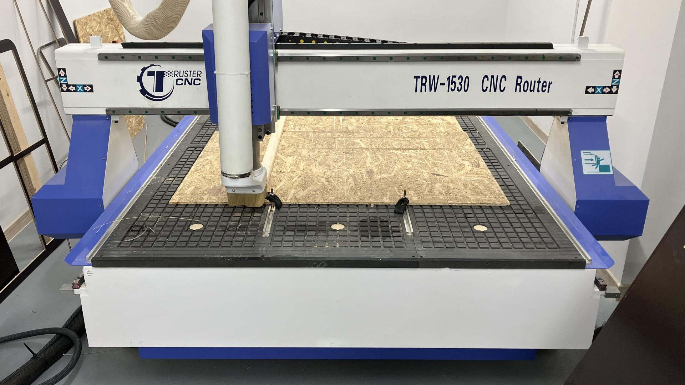
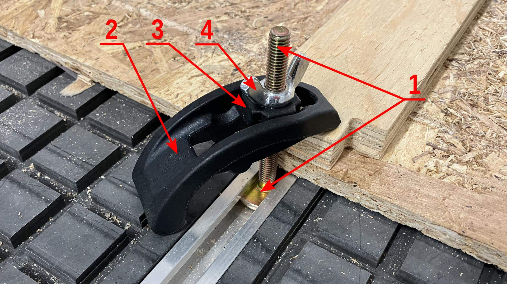

# Sākt darbu ar TRW 350 CNC frēzi lietošanas instrukcija

Šajā sadaļā ir atrodama TRW 350 CNC frēzes lietošanas instrukcija. Pēc šī izlasīšanas, lietotājs spēs veikt sekojošās darbības.

- Uzstādīt materiālu iekārtas darba laukumā
- Nomainīt iekārtas frēzes asmeni
- Iestatīt sākuma punktus iekāŗtas X, Y un Z asīm
- Ielādēt un palaist darba failu ([darba faila sagatavošana](#))

## Darba virsmas sagatavošana

TRW 350 CNC frēze ir aprīkota ar vakuumgaldu un sliedēm stiprinājum-klemmēm. Starp apstrādei paredzēto materiālu un darba galdu nepieciešams ievietot "upurplati". Tā ir aptuveni 10 mm bieza poraina materilāla (MDF vai OBS) plāksne. "Upurplate" palīdz novērst iespēju sabojāt iekārtas galda virsmu neparedzētu kļūmju gadījumā, kā arī nodrošina gaisa plūsmu starp apstrādei paredzēto materiālu un vakuuma galdu. 

Atkarībā no izmantojamā materiāla izmēriem un dizaina ieceres, var tikt izmantots vai nu tikai vakuumgalds, vai tikai klemmes, vai abi.

### Materiāla stiprināšana ar klemmēm

Klemmes sastāv no četrām daļām.

1. Skrūves ar T-veida galvu, kas ir saderīga ar iekārtas galdā iebūvētajām sliedēm
2. Klemmes, kas paredzēta saskarei ar materiāla virsmu tās tievākajā galā, un iekārtas galdu resnākajā galā
3. Plastmasas ielikņa.
4. Tauriņveida uzgriežņa, klemmes pievilkšanai galda virzienā.

### Materiāla stiprināšana ar vakūmgaldu

Atkarībā no materiāla izmēriem, nepieciešams atvērt vienu vai vairākus vakuuma vārstus. Katrs no deviņiem vārstiem atver vai noslēdz vakuuma ietekmi uz vienu no deviņiem vakuuma galda blokiem.

Vakuuma vārstu shēma.

1: kreisā puse tuvākais
2: kreisā puse centrālais
3: kreisā puse tālākais

4: vidējais tuvākais
5: vidējais centrālais
6: vidējais tālākais

7: labā puse tuvākais
8: labā puse centrālais
9: labā puse tālākais

